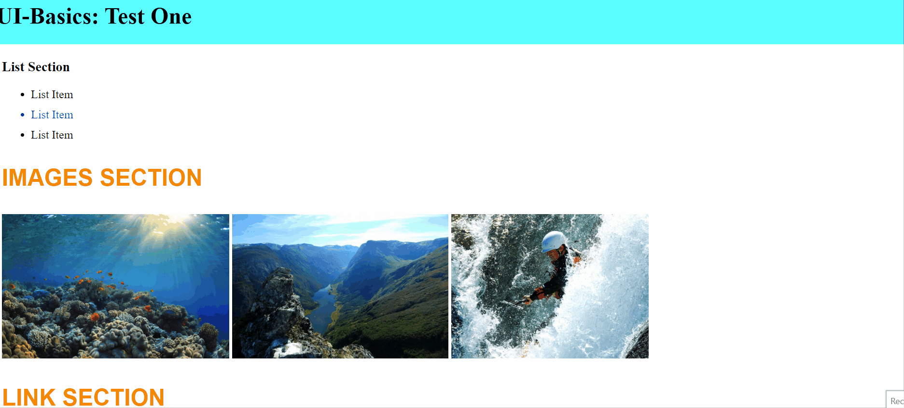

# UI-Basics Test: First Test
## General Instructions

* Work from the `index.html` file and a CSS stylesheet.

* You can use google, but you cannot ask your teacher/s or your classmates for help. 

* Good luck! 

## Test Instructions
### Starting Up
* Make and link a CSS stylesheet and work from there.

* Use positioning to fix the header to the top of the page. It should take up 100% of the available space and not cover any of the content below. Give the header a background color of **cyan**.

### Content Styling 
* In the "_List_" section, change the color of the second list item to blue.

* In the "_Images_" section, make all of the images appear side-by-side.

* Give three `h3` elements in the html document the same class. 

* Using the class you gave to the elements, change the color those three `h3` elements to orange using rbg. The size of the text should be `2em`. The text should appear as uppercase. However, you shouldn't manually uppercase these. You should Google to find and use the CSS property that allows you to specify how to capitalize an element's text. 

* Select all descendant links in the footer. Change the links' color to green on `visited` and red on `hover`.

### Box Model 
* In the "_Box Model_" section, add `5 pixels` of `padding` to the section element that contains a paragraph and an image.

* In the "_Box Model_" section, make sure the margins of the section element which contains a paragraph and an image is `10%` of its parent's width.

### Images & Links 
* In the "_Link_" section, insert a link that redirects the user to an image of your favourite book cover. Make sure that the image opens in a new tab.

* In the "_Images_" section, add the image `tree.jpg` from the image folder. Make the image appear circular. Add [this](https://caseytrees.org/tree-species/) link to the `tree.jpg` image.

### Hierarchy
* Move the `<footer>` element in the HTML file to the bottom of the document.

